# Tutorial: Understanding Backdoor Paths in Causal Inference

## Overview

This tutorial will teach you how to identify and block backdoor paths in causal graphs. By the end, you'll understand when you can replace an intervention with conditioning and how to identify valid adjustment sets.

**Learning Objectives:**

* Understand what paths and backdoor paths are
* Learn the rules for blocking paths
* Apply the backdoor criterion to real examples
* Practice diagnosing causal graphs

---

## 1. The Core Problem

### What We Want to Know

In causal inference, we often want to estimate the causal effect of treatment $C$ on outcome $X$:

$$p(X \mid do(C))$$

But we can only observe conditional probabilities:

$$p(X \mid C, Z)$$

**Key Question:** When can we replace intervention with conditioning?

$$p(X \mid do(C)) \stackrel{?}{=} \sum_z p(X \mid C, z) \cdot p(Z)$$

**Answer:** When $Z$ blocks all backdoor paths from $C$ to $X$.

---

## 2. Foundations: What is a Path?

### Definition

A **path** is any sequence of variables connected by edges, **ignoring arrow direction**.

### Example Paths Between $C$ and $X$

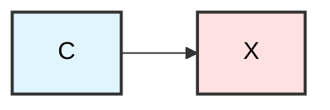

**Path 1:** $C \rightarrow X$ (direct causal path)

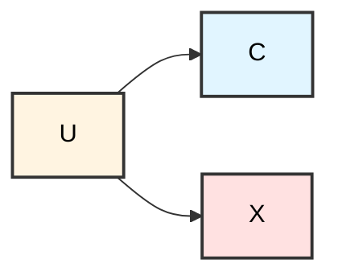

**Path 2:** $C \leftarrow U \rightarrow X$ (backdoor path through confounder)

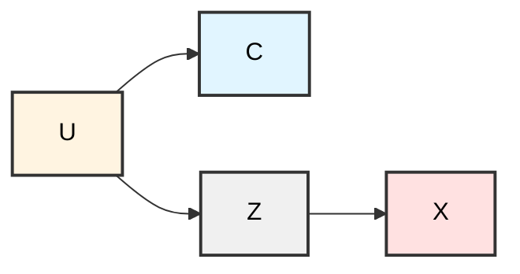

**Path 3:** $C \leftarrow U \rightarrow Z \rightarrow X$ (longer backdoor path)

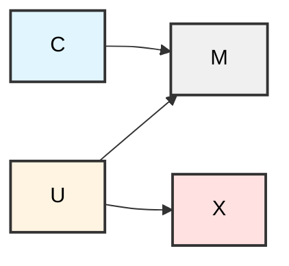

**Path 4:** $C \rightarrow M \leftarrow U \rightarrow X$ (path through collider)

**Key Point:** Direction doesn't matter for *being* a path. Direction matters for *classifying* and *blocking* paths.

---

## 3. What Makes a Path a Backdoor Path?

### Precise Definition

> A **backdoor path** from $C$ to $X$ is any path that **starts with an arrow pointing INTO $C$**.

That's it. Nothing more complex.

### Example 1: Direct Causal Path (NOT a Backdoor)

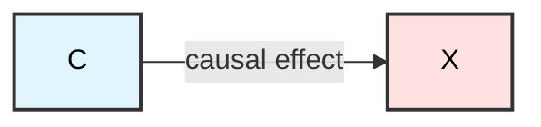

**Path:** $C \rightarrow X$

* Starts with arrow **out of** $C$
* ✅ **Front-door (causal) path**
* ❌ **Not a backdoor path**

### Example 2: Classic Confounder (IS a Backdoor)

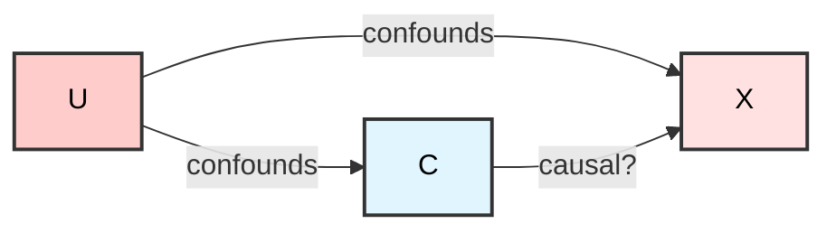

**Backdoor Path:** $C \leftarrow U \rightarrow X$

* Starts with arrow **into** $C$ (i.e., $C \leftarrow U$)
* ✅ **Backdoor path**
* This path carries **spurious association**

**Why it's dangerous:** $U$ causes both $C$ and $X$, creating a non-causal association between them.

### Example 3: Longer Backdoor Path

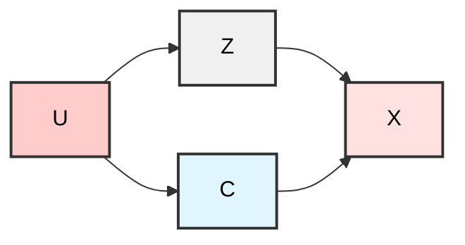

**Backdoor Path:** $C \leftarrow U \rightarrow Z \rightarrow X$

* Still starts with $C \leftarrow U$
* ✅ **Backdoor path** (even though it's longer)

---

## 4. Why Backdoor Paths Are Dangerous

Backdoor paths allow **information to flow from $C$ to $X$** without $C$ causing $X$.

### The Algebra

**With backdoor path (observational):**
$$p(X \mid C) = \sum_u p(X \mid C, U) \cdot p(U \mid C)$$

**Without backdoor path (interventional):**
$$p(X \mid do(C)) = \sum_u p(X \mid C, U) \cdot p(U)$$

**The Problem:** The backdoor path makes $p(U \mid C) \neq p(U)$, introducing bias.

### Intuition

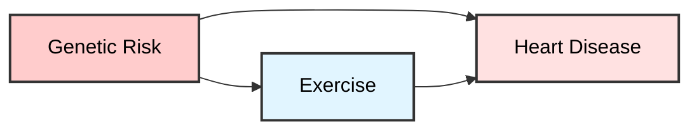

People with high genetic risk might exercise more (or less). This creates a spurious association between exercise and heart disease that isn't purely causal.

---

## 5. Blocking Paths: The Rules

A path is **blocked** when information cannot flow through it. Here are the rules:

### Rule 1: Conditioning on a Non-Collider Blocks the Path

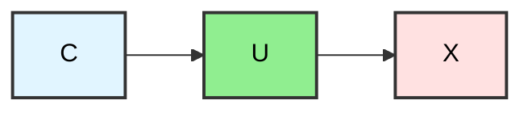

**Path:** $C \rightarrow U \rightarrow X$

**If we condition on $U$:** The path is **blocked** ✅

**Why:** Conditioning on $U$ "holds it constant," preventing information flow.

### Rule 2: A Collider Blocks the Path by Default

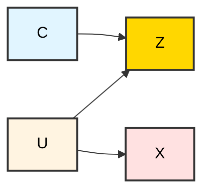

**Path:** $C \rightarrow Z \leftarrow U \rightarrow X$

**Collider:** $Z$ (two arrows point into it)

**Status:** Path is **blocked by default** ✅

**Key Point:** Do NOT condition on colliders!

### Rule 3: Conditioning on a Collider OPENS the Path (The Trap!)

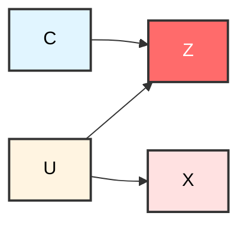

**If we condition on $Z$:** The path **opens** ❌

**Why:** Conditioning on a collider creates a spurious association between its parents.

### Example: Collider Bias

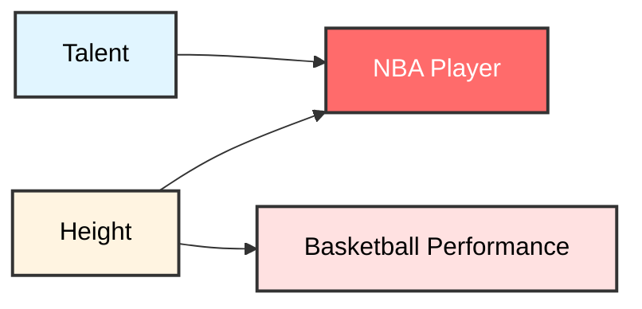

Among NBA players (conditioning on $S$), talent and height appear negatively correlated—but this is spurious!

---

## 6. The Backdoor Criterion (Formal Statement)

A set of variables $Z$ satisfies the **backdoor criterion** relative to $(C, X)$ if:

### Condition 1: No Descendants of Treatment

**No variable in $Z$ is a descendant of $C$**

**Reason:** You don't adjust for consequences of treatment (that would block the causal effect!)

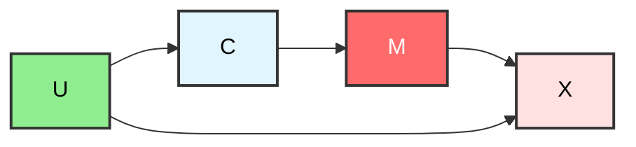

* ✅ Adjust for $U$ (confounder)
* ❌ Do NOT adjust for $M$ (mediator/descendant)

### Condition 2: Block All Backdoor Paths

**$Z$ blocks every backdoor path from $C$ to $X$**

Every path starting with an arrow into $C$ must be blocked.

### The Payoff

If both conditions hold:

$$p(X \mid do(C)) = \sum_z p(X \mid C, z) \cdot p(z)$$

You can estimate causal effects from observational data!

---

## 7. Worked Examples

### Example 1: Simple Confounder

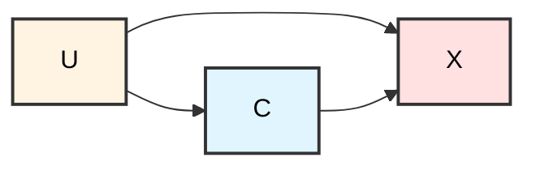

**Question:** Should we adjust for $U$?

**Analysis:**

* **Backdoor path:** $C \leftarrow U \rightarrow X$
* **Is $U$ a descendant of $C$?** No ✅
* **Does $U$ block the backdoor path?** Yes ✅

**Answer:** ✅ Adjust for $U$

### Example 2: Collider Bias

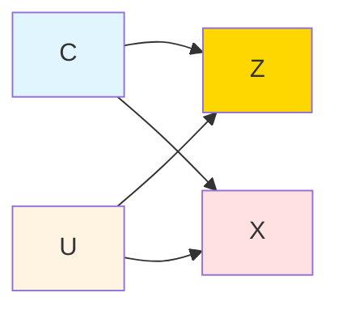

**Question:** Should we adjust for $Z$?

**Analysis:**

* **Backdoor path:** $C \rightarrow Z \leftarrow U \rightarrow X$
* **Is $Z$ a collider?** Yes
* **Is the path blocked by default?** Yes ✅
* **What happens if we condition on $Z$?** Opens the path ❌

**Answer:** ❌ Do NOT adjust for $Z$

### Example 3: Multiple Paths

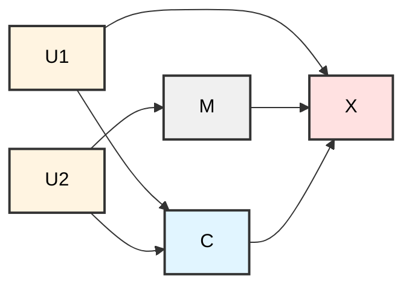

**Question:** What should we adjust for?

**Analysis:**

* **Backdoor path 1:** $C \leftarrow U_1 \rightarrow X$
* **Backdoor path 2:** $C \leftarrow U_2 \rightarrow M \rightarrow X$
* **Adjustment set:** $\{U_1, U_2\}$
* **Are they descendants of $C$?** No ✅
* **Do they block all backdoor paths?** Yes ✅

**Answer:** ✅ Adjust for $\{U_1, U_2\}$

### Example 4: Mediator Trap

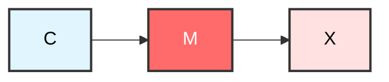

**Question:** Should we adjust for $M$?

**Analysis:**

* **No backdoor paths** (no arrows into $C$)
* **Is $M$ a descendant of $C$?** Yes
* **What happens if we condition on $M$?** Blocks the causal path!

**Answer:** ❌ Do NOT adjust for $M$ (it's a mediator)

---

## 8. Practice Problems

Test your understanding with these diagnostic exercises.

### Problem 1

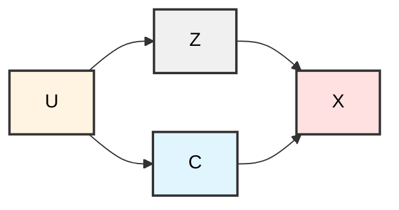

**Questions:**

1. Identify all paths from $C$ to $X$
2. Which paths are backdoor paths?
3. What should you adjust for?

<details>
<summary>Click to see answer</summary>

**Paths:**

1. $C \rightarrow X$ (causal path)
2. $C \leftarrow U \rightarrow Z \rightarrow X$ (backdoor path)

**Backdoor paths:** Path 2 (starts with $C \leftarrow U$)

**Adjustment:** Adjust for either $U$ or $Z$ (both block the backdoor path)

* $U$ is preferred (blocks closer to the source)
</details>

### Problem 2

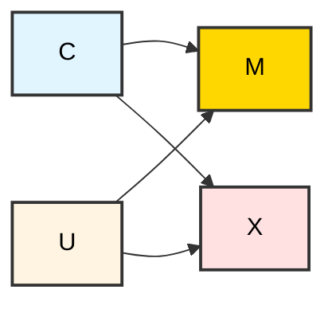

**Questions:**

1. Is there a backdoor path from $C$ to $X$?
2. Should you adjust for $M$?
3. Should you adjust for $U$?

<details>
<summary>Click to see answer</summary>

**Backdoor path:** $C \rightarrow M \leftarrow U \rightarrow X$

**Wait!** This path starts with $C \rightarrow M$, not an arrow into $C$. So it's NOT a backdoor path.

But there IS a backdoor path: None! (No arrows point into $C$)

**Adjustment for $M$:** ❌ No! $M$ is a collider. Conditioning opens a path.

**Adjustment for $U$:** ❌ No! There's no backdoor path to block.

**Correct answer:** No adjustment needed (or adjust for nothing)
</details>

### Problem 3

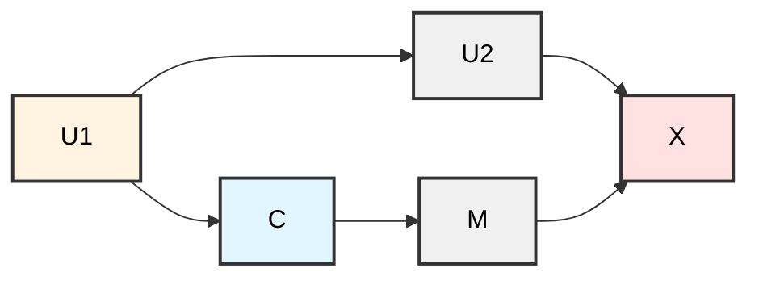

**Questions:**

1. Identify all backdoor paths
2. What are valid adjustment sets?
3. Can you adjust for $M$?

<details>
<summary>Click to see answer</summary>

**Backdoor path:** $C \leftarrow U_1 \rightarrow U_2 \rightarrow X$

**Valid adjustment sets:**

* $\{U_1\}$ ✅
* $\{U_2\}$ ✅
* $\{U_1, U_2\}$ ✅

**Adjust for $M$?** ❌ No! $M$ is a descendant of $C$ (mediator)
</details>

### Problem 4: Complex Graph

```mermaid
graph LR
    U1 --> C
    U1 --> U2
    U2 --> X
    U3 --> C
    U3 --> Z
    Z --> X
    C --> X
    style C fill:#e1f5ff,stroke:#333,stroke-width:2px,color:#000
    style X fill:#ffe1e1,stroke:#333,stroke-width:2px,color:#000
    style U1 fill:#fff4e1,stroke:#333,stroke-width:2px,color:#000
    style U2 fill:#f0f0f0,stroke:#333,stroke-width:2px,color:#000
    style U3 fill:#fff4e1,stroke:#333,stroke-width:2px,color:#000
    style Z fill:#f0f0f0,stroke:#333,stroke-width:2px,color:#000
```

**Questions:**

1. How many backdoor paths are there?
2. What is the minimal sufficient adjustment set?
3. Is $\{U_2, Z\}$ a valid adjustment set?

<details>
<summary>Click to see answer</summary>

**Backdoor paths:**

1. $C \leftarrow U_1 \rightarrow U_2 \rightarrow X$
2. $C \leftarrow U_3 \rightarrow Z \rightarrow X$

**Minimal sufficient adjustment sets:**

* $\{U_1, U_3\}$ ✅ (blocks at the source)
* $\{U_1, Z\}$ ✅
* $\{U_2, U_3\}$ ✅
* $\{U_2, Z\}$ ✅

**Is $\{U_2, Z\}$ valid?** ✅ Yes! It blocks both backdoor paths.
</details>

### Problem 5: The Butterfly

```mermaid
graph LR
    U1 --> C
    U1 --> M
    U2 --> M
    U2 --> X
    C --> X
    style C fill:#e1f5ff,stroke:#333,stroke-width:2px,color:#000
    style X fill:#ffe1e1,stroke:#333,stroke-width:2px,color:#000
    style U1 fill:#fff4e1,stroke:#333,stroke-width:2px,color:#000
    style U2 fill:#fff4e1,stroke:#333,stroke-width:2px,color:#000
    style M fill:#FFD700,stroke:#333,stroke-width:2px,color:#000
```

**Questions:**

1. Is there a backdoor path?
2. Should you adjust for $M$?
3. What should you adjust for?

<details>
<summary>Click to see answer</summary>

**Backdoor path:** $C \leftarrow U_1 \rightarrow M \leftarrow U_2 \rightarrow X$

**Is it blocked by default?** ✅ Yes! $M$ is a collider.

**Adjust for $M$?** ❌ No! That would OPEN the path.

**Correct adjustment:** No adjustment needed (the path is already blocked)

**Alternative:** Could adjust for $U_1$ or $U_2$ (but not necessary)
</details>

---

## 9. Common Pitfalls

### Pitfall 1: Adjusting for Mediators

```mermaid
graph LR
    C --> M
    M --> X
    style C fill:#e1f5ff,stroke:#333,stroke-width:2px,color:#000
    style X fill:#ffe1e1,stroke:#333,stroke-width:2px,color:#000
    style M fill:#ff6b6b,stroke:#333,stroke-width:2px,color:#fff
```

**Wrong:** Adjust for $M$

**Why wrong:** Blocks the causal path you want to estimate!

### Pitfall 2: Adjusting for Colliders

```mermaid
graph LR
    C --> Z
    U --> Z
    U --> X
    style C fill:#e1f5ff,stroke:#333,stroke-width:2px,color:#000
    style X fill:#ffe1e1,stroke:#333,stroke-width:2px,color:#000
    style Z fill:#ff6b6b,stroke:#333,stroke-width:2px,color:#fff
    style U fill:#fff4e1,stroke:#333,stroke-width:2px,color:#000
```

**Wrong:** Adjust for $Z$

**Why wrong:** Opens a backdoor path!

### Pitfall 3: Adjusting for Descendants of Treatment

```mermaid
graph LR
    C --> D
    D --> X
    U --> C
    U --> X
    style C fill:#e1f5ff,stroke:#333,stroke-width:2px,color:#000
    style X fill:#ffe1e1,stroke:#333,stroke-width:2px,color:#000
    style D fill:#ff6b6b,stroke:#333,stroke-width:2px,color:#fff
    style U fill:#90EE90,stroke:#333,stroke-width:2px,color:#000
```

**Wrong:** Adjust for $D$

**Why wrong:** $D$ is a descendant of $C$ (post-treatment variable)

**Right:** Adjust for $U$ only

---

## 10. Key Takeaways

### The One-Sentence Summary

> **A backdoor path is any non-causal route by which observing $C$ tells you something about other causes of $X$.**

Blocking backdoor paths is how we make *seeing* $C$ behave like *doing* $C$.

### The Rules (Quick Reference)

1. **Backdoor path:** Any path starting with an arrow INTO the treatment
2. **Blocking:** Condition on non-colliders, avoid colliders
3. **Backdoor criterion:**
   * Block all backdoor paths
   * Don't adjust for descendants of treatment

### Decision Tree

```mermaid
graph TD
    A[Is there a path from C to X?] -->|Yes| B[Does it start with arrow INTO C?]
    A -->|No| Z1[No backdoor path]
    B -->|Yes| C[Backdoor path!]
    B -->|No| Z2[Causal path only]
    C --> D[Is there a collider on the path?]
    D -->|Yes| E[Path blocked by default]
    D -->|No| F[Need to adjust]
    E --> G[Do NOT condition on collider]
    F --> H[Condition on non-collider]
    
    style C fill:#ffcccc
    style E fill:#90EE90
    style F fill:#fff4e1
    style G fill:#ff6b6b
    style H fill:#90EE90
```

---

## 11. Further Practice

### Challenge Problem 1: The M-Graph

```mermaid
graph LR
    U1 --> C
    U1 --> M
    U2 --> M
    U2 --> X
    C --> Y
    Y --> X
    M --> Y
    style C fill:#e1f5ff,stroke:#333,stroke-width:2px,color:#000
    style X fill:#ffe1e1,stroke:#333,stroke-width:2px,color:#000
    style U1 fill:#fff4e1,stroke:#333,stroke-width:2px,color:#000
    style U2 fill:#fff4e1,stroke:#333,stroke-width:2px,color:#000
    style M fill:#f0f0f0,stroke:#333,stroke-width:2px,color:#000
    style Y fill:#f0f0f0,stroke:#333,stroke-width:2px,color:#000
```

Identify all backdoor paths and determine valid adjustment sets.

### Challenge Problem 2: Selection Bias

```mermaid
graph LR
    C --> S
    X --> S
    U --> C
    U --> X
    style C fill:#e1f5ff,stroke:#333,stroke-width:2px,color:#000
    style X fill:#ffe1e1,stroke:#333,stroke-width:2px,color:#000
    style S fill:#FFD700,stroke:#333,stroke-width:2px,color:#000
    style U fill:#fff4e1,stroke:#333,stroke-width:2px,color:#000
```

What happens if you condition on $S$ (e.g., selecting only certain samples)?

### Challenge Problem 3: Instrumental Variable Setup

```mermaid
graph LR
    Z --> C
    U --> C
    U --> X
    C --> X
    style Z fill:#90EE90,stroke:#333,stroke-width:2px,color:#000
    style C fill:#e1f5ff,stroke:#333,stroke-width:2px,color:#000
    style X fill:#ffe1e1,stroke:#333,stroke-width:2px,color:#000
    style U fill:#fff4e1,stroke:#333,stroke-width:2px,color:#000
```

Can you estimate the causal effect without measuring $U$? (Hint: This is an IV setup)

---

## 12. Next Steps

Now that you understand backdoor paths, you can explore:

1. **Front-door criterion:** What if you can't block all backdoor paths?
2. **Instrumental variables:** Using variables that affect treatment but not outcome directly
3. **Do-calculus:** The complete rules for causal identification
4. **Sensitivity analysis:** What if there are unmeasured confounders?

---

## References and Further Reading

* Pearl, J. (2009). *Causality: Models, Reasoning, and Inference*
* Pearl, J., Glymour, M., & Jewell, N. P. (2016). *Causal Inference in Statistics: A Primer*
* Hernán, M. A., & Robins, J. M. (2020). *Causal Inference: What If*
* [Causal Inference: The Mixtape](https://mixtape.scunning.com/) by Scott Cunningham

---

## Appendix: Why Descendants Are Forbidden

This is subtle and important. Let's walk through it step-by-step.

### Setup

```mermaid
graph LR
    C --> M
    M --> X
    U --> C
    U --> X
    style C fill:#e1f5ff,stroke:#333,stroke-width:2px,color:#000
    style X fill:#ffe1e1,stroke:#333,stroke-width:2px,color:#000
    style M fill:#f0f0f0,stroke:#333,stroke-width:2px,color:#000
    style U fill:#fff4e1,stroke:#333,stroke-width:2px,color:#000
```

### The Question

Why can't we adjust for $M$ (a descendant of $C$)?

### The Answer

**Backdoor path:** $C \leftarrow U \rightarrow X$

**Option 1:** Adjust for $U$ only
$$p(X \mid do(C)) = \sum_u p(X \mid C, u) \cdot p(u)$$
✅ Correct!

**Option 2:** Adjust for $M$ (wrong!)

* $M$ is caused by $C$
* Conditioning on $M$ means we're looking at different "types" of $C$ based on its effect
* This blocks part of the causal effect we want to estimate!

### Concrete Example

* $C$: Exercise program
* $M$: Weight loss (mediator)
* $X$: Blood pressure
* $U$: Baseline health

If we condition on weight loss ($M$), we're asking: "Among people who lost the same amount of weight, what's the effect of the exercise program?"

This **blocks the causal pathway** $C \rightarrow M \rightarrow X$ and underestimates the total effect!

### The Rule

> Never adjust for variables on the causal path from treatment to outcome.

This includes mediators, descendants, and any post-treatment variables.
