# Do-Calculus: A Comprehensive Tutorial on Causal Reasoning with Graphs

This tutorial introduces **do-calculus**, Pearl's formal system for reasoning about causal effects using directed acyclic graphs (DAGs). Do-calculus provides a set of graph-based rules that let us transform interventional queries like $p(y \mid do(x))$ into expressions we can estimate from observational data.

## What You'll Learn

* The difference between observational conditioning and causal intervention
* How to represent causal assumptions using DAGs
* The concept of d-separation and how it determines conditional independence
* The three rules of do-calculus with detailed examples
* How to derive the back-door and front-door adjustment formulas
* Common pitfalls like collider bias
* Practice problems with step-by-step solutions

## Prerequisites

* Basic probability theory (conditional probability, Bayes' rule)
* Familiarity with directed graphs
* Understanding of backdoor paths (see [backdoor paths tutorial](backdoor_paths.md))

## Table of Contents

1. [Basic Objects and Notation](#1-basic-objects-and-notation)
2. [The Purpose of Do-Calculus](#2-the-purpose-of-do-calculus)
3. [Graph Surgery: The Do-Operator](#3-graph-surgery-the-do-operator)
4. [D-Separation: The Engine of Causal Reasoning](#4-d-separation-the-engine-of-causal-reasoning)
5. [The Three Rules of Do-Calculus](#5-the-three-rules-of-do-calculus)
6. [Worked Example: Back-Door Adjustment](#6-worked-example-back-door-adjustment)
7. [Worked Example: Front-Door Adjustment](#7-worked-example-front-door-adjustment)
8. [Worked Example: The Collider Trap](#8-worked-example-the-collider-trap)
9. [Additional Worked Examples](#9-additional-worked-examples)
10. [Practice Problems](#10-practice-problems)
11. [Applications in Computational Biology](#11-applications-in-computational-biology)
12. [Practical Checklist](#12-practical-checklist)

---

## 1. Basic Objects and Notation

### Variables

In causal inference, we typically work with:

* $X$: **Treatment/intervention variable** (drug exposure, gene knockdown, CRISPR perturbation)
* $Y$: **Outcome** (phenotype, gene expression, survival)
* $Z, W$: **Covariates** (cell state, batch, donor, disease severity)
* $U$: **Unobserved confounder** (latent factors, unmeasured biology)

### Two Kinds of Probability Statements

**Observational (seeing):**

$$p(y \mid x) \quad \text{or} \quad p(y \mid x, z)$$

This is standard conditional probability: "Among samples where $X = x$, what is the distribution of $Y$?"

**Interventional (doing):**

$$p(y \mid do(x))$$

This means: "What would $Y$ look like if we *forced* $X$ to take value $x$, regardless of what would naturally cause $X$ to be that value?"

### The Critical Distinction

In general:

$$p(y \mid do(x)) \neq p(y \mid x)$$

**Why?** Conditioning doesn't break confounding, but interventions do.

**Example:** Consider the relationship between carrying a lighter and lung cancer. Observationally, $p(\text{cancer} \mid \text{lighter})$ is elevated because smokers carry lighters. But $p(\text{cancer} \mid do(\text{lighter}))$—the effect of *forcing* someone to carry a lighter—is essentially zero. The intervention breaks the confounding path through smoking.

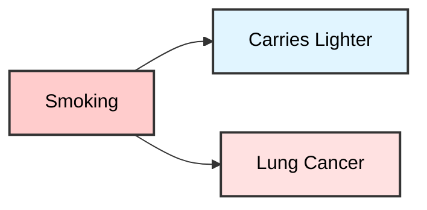

**Observational:** $p(\text{cancer} \mid \text{lighter}) > p(\text{cancer})$ (spurious association)

**Interventional:** $p(\text{cancer} \mid do(\text{lighter})) = p(\text{cancer})$ (no causal effect)

### Graph Language: Directed Acyclic Graphs (DAGs)

We represent causal assumptions with a **directed acyclic graph (DAG)**:

* **Nodes** represent variables
* **Directed edges** ($\to$) represent direct causal influence
* **Bidirected edges** ($\leftrightarrow$) represent unobserved common causes (shorthand for a hidden $U$ causing both endpoints)
* **Acyclic** means no variable can cause itself through any path

**Example DAG:**

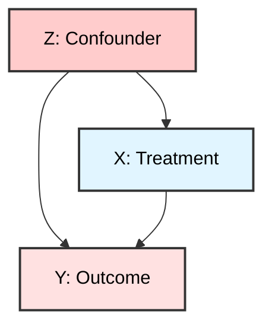

Here $Z$ is a **confounder**: it causes both $X$ and $Y$, creating a spurious association between them.

---

## 2. The Purpose of Do-Calculus

Do-calculus addresses two fundamental tasks:

1. **Identification:** Can we rewrite $p(y \mid do(x))$ using only observational quantities like $p(y \mid x, z)$, $p(z \mid x)$, etc.?

2. **Estimation:** Once identified, estimate the causal effect from data.

Do-calculus solves task (1) using graph-based rules. If you cannot rewrite the interventional query in observational terms, then your assumptions and measurements are insufficient to identify the causal effect from observational data alone—you need experiments.

### The Identification Problem

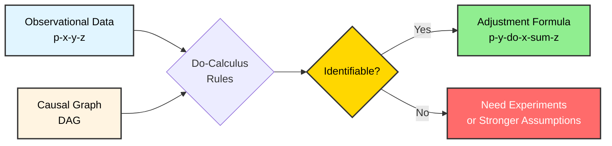

---

## 3. Graph Surgery: The Do-Operator

The $do(x)$ operator has a precise graphical interpretation: **cut all arrows into $X$, then set $X = x$**.

### Notation

* $G$: the original causal graph
* $G_{\overline{X}}$: the **mutilated graph** with all incoming edges to $X$ removed ("bar $X$")
* $G_{\underline{X}}$: the graph with all outgoing edges from $X$ removed ("underline $X$")

### Intuition

When we intervene on $X$:

* We sever $X$ from its natural causes
* $X$ becomes like a randomized treatment—its value is set externally
* All downstream effects of $X$ remain intact

### Visual Example: Graph Surgery

**Original graph $G$:**

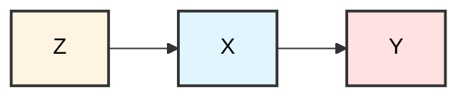

**After $do(x)$ - Mutilated graph $G_{\overline{X}}$:**

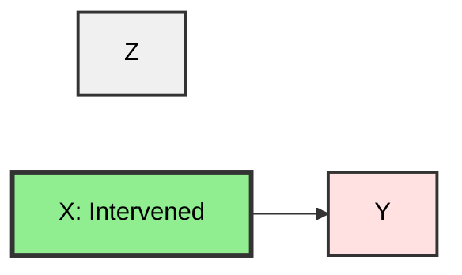

The arrow $Z \to X$ is cut. Now $X$ is independent of $Z$ in the mutilated graph: $p(x \mid do(x)) = 1$ if $X = x$, and 0 otherwise.

### Key Insight

$$p(Y \mid do(X = x)) = p(Y \mid X = x \text{ in } G_{\overline{X}})$$

The interventional distribution in $G$ equals the observational distribution in the mutilated graph $G_{\overline{X}}$.

---

## 4. D-Separation: The Engine of Causal Reasoning

**D-separation** (directional separation) is the key concept that determines which conditional independences hold in a DAG. It's the foundation for all do-calculus rules.

### Definition

A set of variables $S$ **d-separates** $A$ from $B$ in a DAG $G$ if $S$ blocks every path between $A$ and $B$.

### The Three Path Types

To understand d-separation, we need to understand three types of path structures:

#### 1. Chain (Mediation): $A \to M \to B$

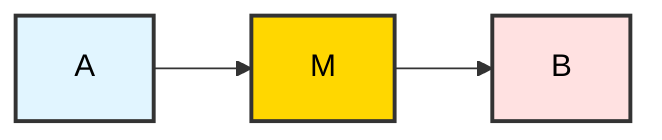

* **Unconditionally:** $A$ and $B$ are associated (information flows through $M$)
* **Conditioning on $M$:** Blocks the path; $A \perp\!\!\!\perp B \mid M$

**Example:** Smoking → Tar in lungs → Cancer. Conditioning on tar blocks the association between smoking and cancer through this path.

#### 2. Fork (Confounding): $A \leftarrow C \to B$

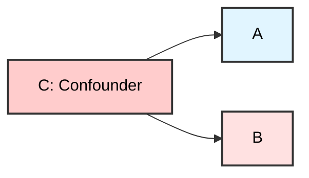

* **Unconditionally:** $A$ and $B$ are associated (both caused by $C$)
* **Conditioning on $C$:** Blocks the path; $A \perp\!\!\!\perp B \mid C$

**Example:** Genetics → Smoking, Genetics → Cancer. Conditioning on genetics blocks the spurious association.

#### 3. Collider (Inverted Fork): $A \to C \leftarrow B$

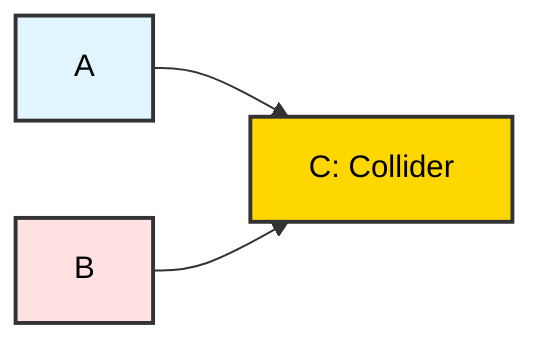

* **Unconditionally:** Path is **blocked**; $A \perp\!\!\!\perp B$
* **Conditioning on $C$:** **Opens** the path; $A$ and $B$ become associated!

**Example:** Talent → Hollywood success ← Beauty. Among successful actors (conditioning on the collider), talent and beauty become negatively correlated—the "explain-away" effect.

### D-Separation Algorithm

To check if $S$ d-separates $A$ from $B$:

1. List all paths between $A$ and $B$
2. For each path, check if it's blocked by $S$:
   * A chain or fork is blocked if the middle node is in $S$
   * A collider is blocked if the collider (and all its descendants) is NOT in $S$
3. If ALL paths are blocked, $A$ and $B$ are d-separated given $S$

### Worked D-Separation Examples

#### Example 1: Simple Confounding

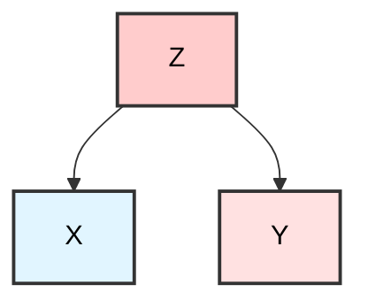

* Path $X \leftarrow Z \to Y$ is a fork at $Z$
* $X \perp\!\!\!\perp Y \mid Z$? **Yes** ✅ (conditioning on $Z$ blocks the fork)
* $X \perp\!\!\!\perp Y$? **No** ❌ (path is open)

#### Example 2: Mediation

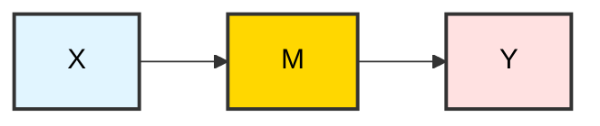

* Path $X \to M \to Y$ is a chain through $M$
* $X \perp\!\!\!\perp Y \mid M$? **Yes** ✅ (conditioning blocks the chain)
* $X \perp\!\!\!\perp Y$? **No** ❌ (path is open)

#### Example 3: Collider

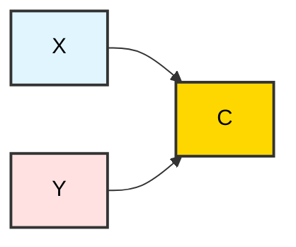

* Path $X \to C \leftarrow Y$ is a collider at $C$
* $X \perp\!\!\!\perp Y$? **Yes** ✅ (collider blocks the path)
* $X \perp\!\!\!\perp Y \mid C$? **No** ❌ (conditioning opens the collider!)

#### Example 4: Complex Graph

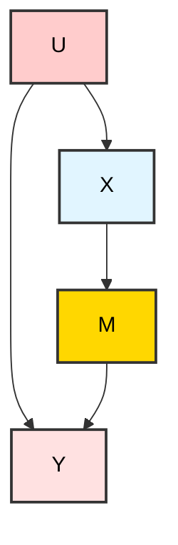

**Paths from $X$ to $Y$:**

1. $X \to M \to Y$ (chain through $M$)
2. $X \leftarrow U \to Y$ (fork at $U$)

**Analysis:**

* $X \perp\!\!\!\perp Y$? **No** ❌ (both paths open)
* $X \perp\!\!\!\perp Y \mid U$? **No** ❌ (path 1 still open)
* $X \perp\!\!\!\perp Y \mid M$? **No** ❌ (path 2 still open)
* $X \perp\!\!\!\perp Y \mid M, U$? **Yes** ✅ (both paths blocked)

---

## 5. The Three Rules of Do-Calculus

Do-calculus provides three rules for manipulating interventional expressions. Each rule has a graphical condition based on d-separation in modified graphs.

### Rule 1: Insertion/Deletion of Observations

$$p(y \mid do(x), z, w) = p(y \mid do(x), w)$$

**Condition:** $Y \perp\!\!\!\perp Z \mid X, W$ in $G_{\overline{X}}$ (the graph with incoming edges to $X$ removed)

**Intuition:** After intervening on $X$, observing $Z$ provides no additional information about $Y$ (given $W$).

**When to use:** Remove irrelevant observations from interventional queries.

### Rule 2: Action/Observation Exchange

$$p(y \mid do(x), do(z), w) = p(y \mid do(x), z, w)$$

**Condition:** $Y \perp\!\!\!\perp Z \mid X, W$ in $G_{\overline{X}, \underline{Z}}$ (incoming edges to $X$ removed, outgoing edges from $Z$ removed)

**Intuition:** Under certain graphical conditions, "setting $Z$" is equivalent to "conditioning on $Z$" for predicting $Y$.

**When to use:** Replace interventions with observations when graphical conditions allow.

### Rule 3: Insertion/Deletion of Actions

$$p(y \mid do(x), do(z), w) = p(y \mid do(x), w)$$

**Condition:** $Y \perp\!\!\!\perp Z \mid X, W$ in $G_{\overline{X}, \overline{Z(W)}}$ where $Z(W)$ denotes $Z$-nodes that are not ancestors of any $W$-node in $G_{\overline{X}}$

**Intuition:** Intervening on $Z$ doesn't affect $Y$ once we've intervened on $X$ and conditioned on $W$.

**When to use:** Remove irrelevant interventions from queries.

### Visual Summary of the Rules

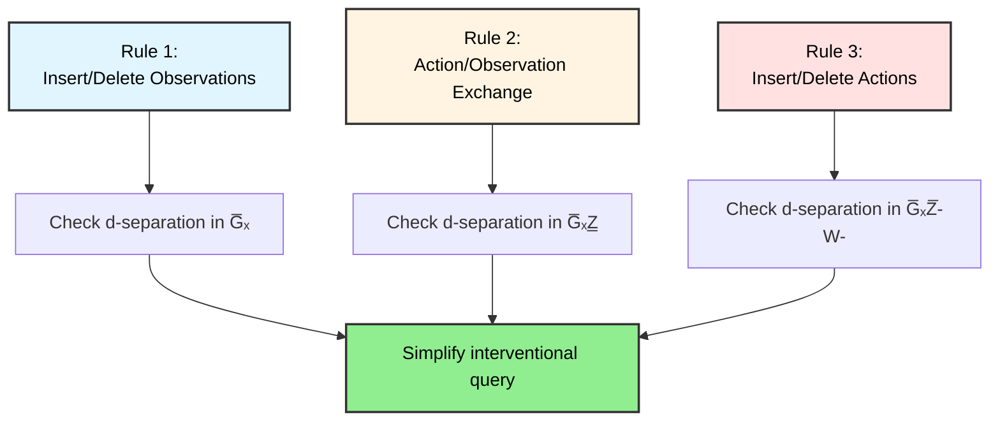

---

## 6. Worked Example: Back-Door Adjustment

### The Graph


$Z$ is a confounder: it causes both $X$ (treatment) and $Y$ (outcome).

**Goal:** Identify $p(y \mid do(x))$.

### Derivation Using Do-Calculus

**Step 1: Law of Total Probability**

$$p(y \mid do(x)) = \sum_z p(y, z \mid do(x))$$

**Step 2: Factor the Joint**

$$p(y, z \mid do(x)) = p(y \mid z, do(x)) \cdot p(z \mid do(x))$$

So:

$$p(y \mid do(x)) = \sum_z p(y \mid z, do(x)) \cdot p(z \mid do(x))$$

**Step 3: Simplify $p(z \mid do(x))$ using Rule 3**

In the mutilated graph $G_{\overline{X}}$:

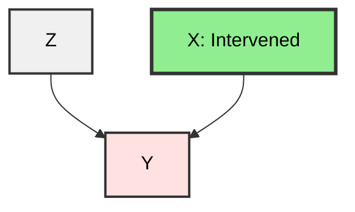

The edge $Z \to X$ is cut. Since $Z$ has no path from $X$ in $G_{\overline{X}}$, and $Z$ is not a descendant of $X$:

$$p(z \mid do(x)) = p(z)$$

**Step 4: Simplify $p(y \mid z, do(x))$ using Rule 2**

In $G_{\overline{X}}$, after conditioning on $Z$, the backdoor path is blocked. We can exchange the action $do(x)$ with observation $x$:

$$p(y \mid z, do(x)) = p(y \mid x, z)$$

**Step 5: Combine**

$$\boxed{p(y \mid do(x)) = \sum_z p(y \mid x, z) \cdot p(z)}$$

This is the **back-door adjustment formula**. It expresses the causal effect entirely in terms of observational quantities.

### Back-Door Criterion (General)

A set $Z$ satisfies the **back-door criterion** relative to $(X, Y)$ if:

1. No node in $Z$ is a descendant of $X$
2. $Z$ blocks every path between $X$ and $Y$ that contains an arrow into $X$

If $Z$ satisfies the back-door criterion:

$$p(y \mid do(x)) = \sum_z p(y \mid x, z) \cdot p(z)$$

---

## 7. Worked Example: Front-Door Adjustment

The front-door adjustment is remarkable: it allows causal identification **even with unmeasured confounding** between treatment and outcome.

### The Graph

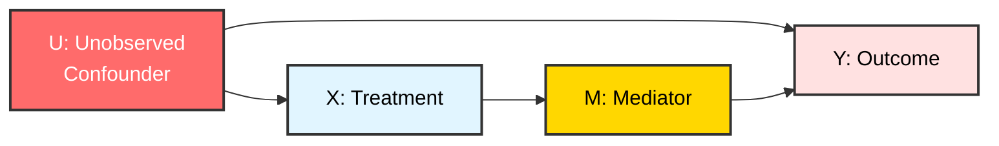

**Key features:**

* $U$ is an unobserved confounder between $X$ and $Y$
* $M$ is a mediator: $X \to M \to Y$
* All causal effect of $X$ on $Y$ goes through $M$
* No confounding between $X$ and $M$
* No confounding between $M$ and $Y$ (except through $X$)

**Goal:** Identify $p(y \mid do(x))$ despite the unmeasured confounder.

### Derivation Using Do-Calculus

**Step 1: Marginalize over the Mediator**

$$p(y \mid do(x)) = \sum_m p(y \mid m, do(x)) \cdot p(m \mid do(x))$$

**Step 2: Simplify $p(m \mid do(x))$ using Rule 2**

Since $M$ is caused by $X$ and there's no confounding between them, in $G_{\overline{X}}$:

$$p(m \mid do(x)) = p(m \mid x)$$

**Step 3: Simplify $p(y \mid m, do(x))$ using Rule 2**

Once we condition on $M$, $X$ has no direct effect on $Y$ (all effect goes through $M$). We need to find $p(y \mid do(m))$.

So:

$$p(y \mid m, do(x)) = p(y \mid do(m))$$

This gives us:

$$p(y \mid do(x)) = \sum_m p(y \mid do(m)) \cdot p(m \mid x)$$

**Step 4: Identify $p(y \mid do(m))$ via Back-Door**

For the effect of $M$ on $Y$, $X$ serves as a valid back-door adjustment set (it blocks the path $M \leftarrow X \leftarrow U \to Y$):

$$p(y \mid do(m)) = \sum_{x'} p(y \mid m, x') \cdot p(x')$$

**Step 5: Combine**

$$\boxed{p(y \mid do(x)) = \sum_m p(m \mid x) \sum_{x'} p(y \mid m, x') \cdot p(x')}$$

This is the **front-door adjustment formula**—one of the most elegant results in causal inference.

### Front-Door Criterion (General)

A set $M$ satisfies the **front-door criterion** relative to $(X, Y)$ if:

1. $M$ intercepts all directed paths from $X$ to $Y$
2. There is no backdoor path from $X$ to $M$
3. All backdoor paths from $M$ to $Y$ are blocked by $X$

---

## 8. Worked Example: The Collider Trap

This example illustrates why "just control for more variables" is dangerous in causal inference.

### The Graph

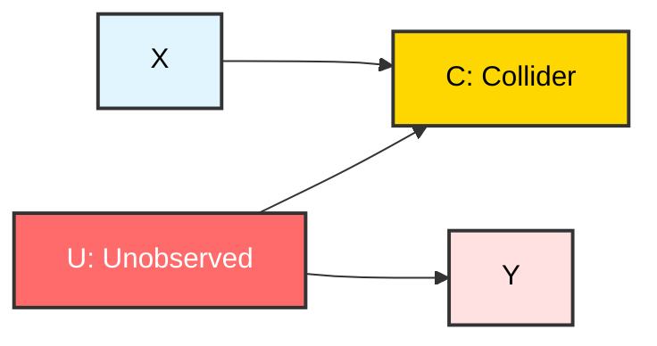

**Key features:**

* $C$ is a **collider**: both $X$ and $U$ cause $C$
* $U$ is unobserved and causes $Y$
* There is no direct effect of $X$ on $Y$

### Analysis

**Without conditioning on $C$:**

* Path $X \to C \leftarrow U \to Y$ is blocked at collider $C$
* $X \perp\!\!\!\perp Y$ (no causal effect, no spurious association)
* $p(y \mid x) = p(y)$ ✅

**With conditioning on $C$:**

* Conditioning on collider $C$ **opens** the path
* $X$ and $U$ become associated (given $C$)
* This creates spurious association between $X$ and $Y$
* $p(y \mid x, c) \neq p(y)$ ❌

### The Lesson

Conditioning on a collider (or its descendants) can **create** bias where none existed. This is called **collider bias** or **selection bias**.

**Real-world example:** 

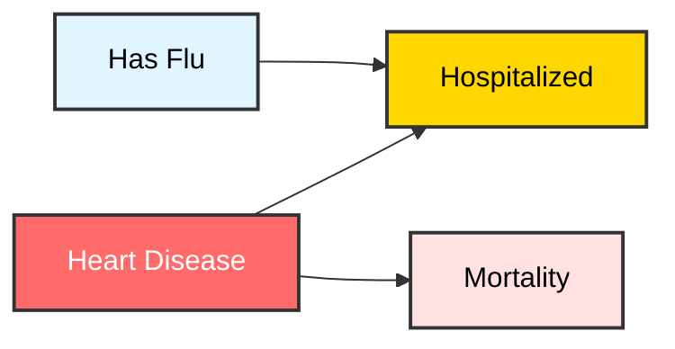

Among hospitalized patients (conditioning on $H$), flu and heart disease become negatively correlated (explaining away), which can create spurious associations with mortality.

---

## 9. Additional Worked Examples

### Example 1: Instrumental Variable

An instrumental variable (IV) is a variable that affects the treatment but not the outcome directly (except through the treatment).

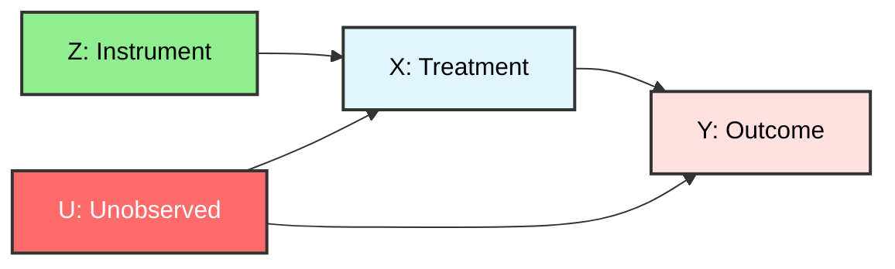

**Goal:** Identify $p(y \mid do(x))$ using the instrument $Z$.

**Key insight:** The IV allows identification even with unmeasured confounding $U$.

**Identification strategy:**

1. $Z$ affects $X$: $p(x \mid z) \neq p(x)$
2. $Z$ affects $Y$ only through $X$
3. $Z$ is independent of $U$

**Derivation (simplified):**

The causal effect can be identified using:

$$\text{Causal Effect} = \frac{\text{Cov}(Y, Z)}{\text{Cov}(X, Z)}$$

This is the basis for **two-stage least squares** (2SLS) regression.

### Example 2: M-Bias Structure

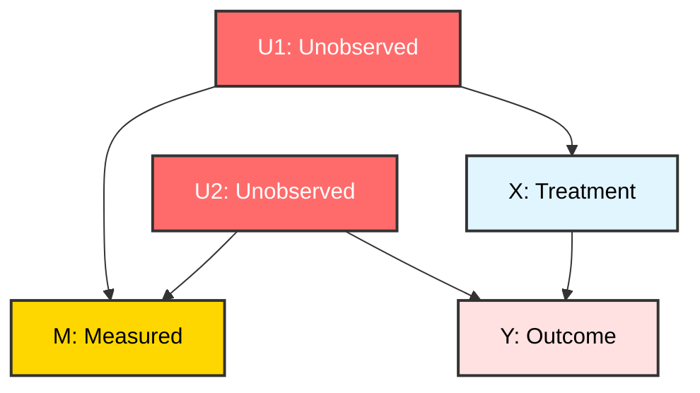

**Analysis:**

* **Without conditioning on $M$:** The path $X \leftarrow U_1 \to M \leftarrow U_2 \to Y$ is blocked at collider $M$
* **Conditioning on $M$:** Opens the path, creating bias!

**Lesson:** Even though $M$ is measured and $U_1, U_2$ are not, conditioning on $M$ introduces bias. This is called **M-bias**.

### Example 3: Butterfly Structure

```mermaid
graph LR
    U1[U1] --> X[X]
    U1 --> M[M: Collider]
    U2[U2] --> M
    U2 --> Y[Y]
    X --> Y
    style U1 fill:#fff4e1,stroke:#333,stroke-width:2px,color:#000
    style U2 fill:#fff4e1,stroke:#333,stroke-width:2px,color:#000
    style M fill:#FFD700,stroke:#333,stroke-width:2px,color:#000
    style X fill:#e1f5ff,stroke:#333,stroke-width:2px,color:#000
    style Y fill:#ffe1e1,stroke:#333,stroke-width:2px,color:#000
```

**Backdoor path:** $X \leftarrow U_1 \to M \leftarrow U_2 \to Y$

**Analysis:**

* Path is **blocked by default** at collider $M$
* No adjustment needed! $p(y \mid do(x)) = p(y \mid x)$
* But if you condition on $M$, you introduce bias

**Lesson:** Sometimes the best adjustment set is the empty set.

### Example 4: Mediation Analysis

```mermaid
graph LR
    X[X: Treatment] --> M1[M1: Mediator 1]
    X --> M2[M2: Mediator 2]
    M1 --> Y[Y: Outcome]
    M2 --> Y
    X --> Y
    style X fill:#e1f5ff,stroke:#333,stroke-width:2px,color:#000
    style M1 fill:#FFD700,stroke:#333,stroke-width:2px,color:#000
    style M2 fill:#FFD700,stroke:#333,stroke-width:2px,color:#000
    style Y fill:#ffe1e1,stroke:#333,stroke-width:2px,color:#000
```

**Goal:** Decompose the total effect into direct and indirect effects.

**Total effect:** $p(y \mid do(x))$ (don't condition on mediators)

**Direct effect:** Effect not through mediators

**Indirect effect through $M_1$:** Effect that goes through $M_1$

**Controlled direct effect:** $p(y \mid do(x), do(m_1), do(m_2))$

This requires careful application of do-calculus rules to identify each component.

---

## 10. Practice Problems

Test your understanding with these problems. Solutions are provided in collapsible sections.

### Problem 1: Simple Adjustment

```mermaid
graph TD
    W[W] --> X[X]
    W --> Z[Z]
    Z --> Y[Y]
    X --> Y
    style W fill:#fff4e1,stroke:#333,stroke-width:2px,color:#000
    style Z fill:#fff4e1,stroke:#333,stroke-width:2px,color:#000
    style X fill:#e1f5ff,stroke:#333,stroke-width:2px,color:#000
    style Y fill:#ffe1e1,stroke:#333,stroke-width:2px,color:#000
```

**Question:** What should you adjust for to identify $p(y \mid do(x))$?

<details>
<summary>Click to see solution</summary>

**Backdoor paths from $X$ to $Y$:**

1. $X \leftarrow W \to Z \to Y$

**Analysis:**

* Adjusting for $W$ blocks the path at the source
* Adjusting for $Z$ blocks the path at $Z$
* Both are valid, but $W$ is preferred (blocks earlier)

**Valid adjustment sets:**

* $\{W\}$ ✅
* $\{Z\}$ ✅
* $\{W, Z\}$ ✅

**Formula:**

$$p(y \mid do(x)) = \sum_w p(y \mid x, w) \cdot p(w)$$

</details>

### Problem 2: Collider Identification

```mermaid
graph LR
    X[X] --> M[M]
    U[U] --> M
    U --> Y[Y]
    X --> Y
    style X fill:#e1f5ff,stroke:#333,stroke-width:2px,color:#000
    style M fill:#FFD700,stroke:#333,stroke-width:2px,color:#000
    style U fill:#ff6b6b,stroke:#333,stroke-width:2px,color:#fff
    style Y fill:#ffe1e1,stroke:#333,stroke-width:2px,color:#000
```

**Question:** Should you adjust for $M$? Why or why not?

<details>
<summary>Click to see solution</summary>

**Analysis:**

* **Backdoor path:** $X \to M \leftarrow U \to Y$
* $M$ is a **collider** on this path
* Path is **blocked by default**

**Answer:** ❌ Do NOT adjust for $M$

**Reason:** The path is already blocked. Conditioning on $M$ would open it and introduce bias.

**Correct formula:**

$$p(y \mid do(x)) = p(y \mid x)$$

No adjustment needed!

</details>

### Problem 3: Multiple Confounders

```mermaid
graph TD
    U1[U1] --> X[X]
    U1 --> Y[Y]
    U2[U2] --> X
    U2 --> Y
    X --> Y
    style U1 fill:#ffcccc,stroke:#333,stroke-width:2px,color:#000
    style U2 fill:#ffcccc,stroke:#333,stroke-width:2px,color:#000
    style X fill:#e1f5ff,stroke:#333,stroke-width:2px,color:#000
    style Y fill:#ffe1e1,stroke:#333,stroke-width:2px,color:#000
```

**Question:** What is the minimal sufficient adjustment set?

<details>
<summary>Click to see solution</summary>

**Backdoor paths:**

1. $X \leftarrow U_1 \to Y$
2. $X \leftarrow U_2 \to Y$

**Analysis:**

* Must block both paths
* Need to adjust for both $U_1$ and $U_2$

**Minimal sufficient adjustment set:** $\{U_1, U_2\}$

**Formula:**

$$p(y \mid do(x)) = \sum_{u_1, u_2} p(y \mid x, u_1, u_2) \cdot p(u_1, u_2)$$

</details>

### Problem 4: Front-Door Application

```mermaid
graph LR
    U[U: Unobserved] --> X[X]
    U --> Y[Y]
    X --> M1[M1]
    X --> M2[M2]
    M1 --> Y
    M2 --> Y
    style U fill:#ff6b6b,stroke:#333,stroke-width:2px,color:#fff
    style X fill:#e1f5ff,stroke:#333,stroke-width:2px,color:#000
    style M1 fill:#FFD700,stroke:#333,stroke-width:2px,color:#000
    style M2 fill:#FFD700,stroke:#333,stroke-width:2px,color:#000
    style Y fill:#ffe1e1,stroke:#333,stroke-width:2px,color:#000
```

**Question:** Can you identify $p(y \mid do(x))$ using front-door adjustment? If so, what is the formula?

<details>
<summary>Click to see solution</summary>

**Check front-door criterion:**

1. Do $\{M_1, M_2\}$ intercept all paths from $X$ to $Y$? ✅ Yes
2. Is there backdoor path from $X$ to $\{M_1, M_2\}$? ❌ No
3. Are backdoor paths from $\{M_1, M_2\}$ to $Y$ blocked by $X$? ✅ Yes

**Answer:** ✅ Yes, front-door adjustment applies!

**Formula:**

$$p(y \mid do(x)) = \sum_{m_1, m_2} p(m_1, m_2 \mid x) \sum_{x'} p(y \mid m_1, m_2, x') \cdot p(x')$$

</details>

### Problem 5: Complex Graph

```mermaid
graph TD
    U[U: Unobserved] --> X[X]
    U --> M[M]
    X --> M
    M --> Y[Y]
    X --> Y
    style U fill:#ff6b6b,stroke:#333,stroke-width:2px,color:#fff
    style X fill:#e1f5ff,stroke:#333,stroke-width:2px,color:#000
    style M fill:#FFD700,stroke:#333,stroke-width:2px,color:#000
    style Y fill:#ffe1e1,stroke:#333,stroke-width:2px,color:#000
```

**Question:** Can you identify $p(y \mid do(x))$? What adjustment strategy should you use?

<details>
<summary>Click to see solution</summary>

**Backdoor path:** $X \leftarrow U \to M \to Y$

**Analysis:**

* Cannot use back-door (would need to adjust for $U$, which is unobserved)
* Cannot use front-door (there's confounding between $X$ and $M$ through $U$)

**Answer:** ❌ **Not identifiable** from observational data alone

**Options:**

1. Conduct an experiment (randomize $X$)
2. Measure $U$
3. Find an instrumental variable
4. Make stronger assumptions (e.g., parametric models)

</details>

---

## 11. Applications in Computational Biology

In computational biology, common causal structures include:

### Example 1: Single-Cell Perturbation Studies

```mermaid
graph TD
    B[Batch] --> P[Perturbation]
    B --> G[Gene Expression]
    C[Cell Cycle] --> P
    C --> G
    P --> G
    P --> S[Cell Survival]
    G --> S
    style B fill:#ffcccc,stroke:#333,stroke-width:2px,color:#000
    style C fill:#ffcccc,stroke:#333,stroke-width:2px,color:#000
    style P fill:#e1f5ff,stroke:#333,stroke-width:2px,color:#000
    style G fill:#ffe1e1,stroke:#333,stroke-width:2px,color:#000
    style S fill:#FFD700,stroke:#333,stroke-width:2px,color:#000
```

**Challenges:**

* **Confounders:** Batch and cell cycle affect both perturbation efficiency and gene expression
* **Collider:** Cell survival is a collider (don't condition on it!)
* **Adjustment:** Must adjust for batch and cell cycle

**Formula:**

$$p(\text{gene} \mid do(\text{perturbation})) = \sum_{b,c} p(\text{gene} \mid \text{perturbation}, b, c) \cdot p(b, c)$$

### Example 2: Mendelian Randomization

```mermaid
graph LR
    G[Genetic Variant] --> E[Exposure]
    U[Unmeasured<br/>Confounders] --> E
    U --> D[Disease]
    E --> D
    style G fill:#90EE90,stroke:#333,stroke-width:2px,color:#000
    style E fill:#e1f5ff,stroke:#333,stroke-width:2px,color:#000
    style U fill:#ff6b6b,stroke:#333,stroke-width:2px,color:#fff
    style D fill:#ffe1e1,stroke:#333,stroke-width:2px,color:#000
```

**Key insight:** Genetic variants are natural instruments (randomized at conception)

**Assumptions:**

1. $G$ affects $E$ (relevance)
2. $G$ affects $D$ only through $E$ (exclusion restriction)
3. $G$ is independent of confounders (exchangeability)

**Application:** Estimate causal effect of cholesterol on heart disease using genetic variants that affect cholesterol levels.

### Example 3: Gene Regulatory Networks

```mermaid
graph TD
    TF[Transcription<br/>Factor] --> G1[Gene 1]
    TF --> G2[Gene 2]
    G1 --> P[Phenotype]
    G2 --> P
    E[Environment] --> TF
    E --> P
    style TF fill:#FFD700,stroke:#333,stroke-width:2px,color:#000
    style G1 fill:#e1f5ff,stroke:#333,stroke-width:2px,color:#000
    style G2 fill:#e1f5ff,stroke:#333,stroke-width:2px,color:#000
    style P fill:#ffe1e1,stroke:#333,stroke-width:2px,color:#000
    style E fill:#ffcccc,stroke:#333,stroke-width:2px,color:#000
```

**Question:** What is the effect of Gene 1 on Phenotype?

**Analysis:**

* **Backdoor path:** $G_1 \leftarrow TF \to G_2 \to P$
* **Adjustment:** Must adjust for $TF$ (and possibly $E$)

### When Do-Calculus Helps

Do-calculus provides the formal framework to determine:

1. **Which covariates are safe to adjust for** (avoid colliders and their descendants)
2. **When a mediator can rescue identification** (front-door criterion)
3. **When observational data cannot identify the effect** (need experiments or additional measurements)
4. **How to design experiments** (which variables to randomize)

---

## 12. Practical Checklist

When you encounter an interventional query $p(\cdot \mid do(\cdot))$:

### Step 1: Draw the DAG

Represent your causal assumptions explicitly.

```mermaid
graph LR
    A[Identify all<br/>relevant variables] --> B[Draw causal<br/>relationships]
    B --> C[Mark unobserved<br/>variables]
    C --> D[Verify acyclicity]
    style A fill:#e1f5ff,stroke:#333,stroke-width:2px,color:#000
    style B fill:#fff4e1,stroke:#333,stroke-width:2px,color:#000
    style C fill:#FFD700,stroke:#333,stroke-width:2px,color:#000
    style D fill:#90EE90,stroke:#333,stroke-width:2px,color:#000
```

### Step 2: Check for Back-Door Adjustment

* Find a set $Z$ that blocks all back-door paths from $X$ to $Y$
* Ensure $Z$ contains no descendants of $X$
* If found: $p(y \mid do(x)) = \sum_z p(y \mid x, z) \cdot p(z)$

### Step 3: If Back-Door Fails, Check for Front-Door

* Find a mediator $M$ such that:
  * $X \to M$ with no confounding
  * All effect of $X$ on $Y$ goes through $M$
  * $X$ blocks confounding for $M \to Y$

### Step 4: If Both Fail

The effect may be **non-identifiable** from observational data.

**Options:**

* Conduct experiments (randomize treatment)
* Find instrumental variables
* Measure additional variables
* Make stronger parametric assumptions

### Step 5: Beware of Colliders

* Never condition on a collider (or its descendants) unless you have a specific reason
* Selection/survival variables are often colliders
* Quality control filters can create collider bias

### Decision Tree

```mermaid
graph TD
    A[Want to identify<br/>p-y-do-x] --> B{Backdoor<br/>adjustment<br/>possible?}
    B -->|Yes| C[Use backdoor<br/>formula]
    B -->|No| D{Front-door<br/>adjustment<br/>possible?}
    D -->|Yes| E[Use front-door<br/>formula]
    D -->|No| F{Instrumental<br/>variable<br/>available?}
    F -->|Yes| G[Use IV methods]
    F -->|No| H[Not identifiable<br/>Need experiment]
    
    style A fill:#e1f5ff,stroke:#333,stroke-width:2px,color:#000
    style B fill:#FFD700,stroke:#333,stroke-width:2px,color:#000
    style C fill:#90EE90,stroke:#333,stroke-width:2px,color:#000
    style D fill:#FFD700,stroke:#333,stroke-width:2px,color:#000
    style E fill:#90EE90,stroke:#333,stroke-width:2px,color:#000
    style F fill:#FFD700,stroke:#333,stroke-width:2px,color:#000
    style G fill:#90EE90,stroke:#333,stroke-width:2px,color:#000
    style H fill:#ff6b6b,stroke:#333,stroke-width:2px,color:#fff
```

---

## Summary

Do-calculus provides a complete, algorithmic approach to causal identification:

| Concept | Key Idea | When to Use |
|---------|----------|-------------|
| $do(x)$ operator | Graph surgery: cut incoming edges to $X$ | Represent interventions |
| D-separation | Determines conditional independence from graph structure | Check if paths are blocked |
| Rule 1 | Insert/delete observations based on d-separation in $G_{\overline{X}}$ | Remove irrelevant observations |
| Rule 2 | Exchange actions and observations | Replace interventions with observations |
| Rule 3 | Insert/delete actions | Remove irrelevant interventions |
| Back-door | Adjust for confounders that block back-door paths | Most common identification strategy |
| Front-door | Use mediator to identify effect despite unmeasured confounding | When back-door fails but mediator exists |
| Collider bias | Conditioning on colliders creates spurious associations | Avoid conditioning on colliders |

## Key Takeaways

1. **Interventions ≠ Observations:** $p(y \mid do(x)) \neq p(y \mid x)$ in general
2. **Graph surgery:** $do(x)$ cuts incoming edges to $X$
3. **D-separation is fundamental:** All do-calculus rules rely on d-separation
4. **Back-door is most common:** Adjust for confounders
5. **Front-door is powerful:** Can identify effects with unmeasured confounding
6. **Colliders are dangerous:** Never condition on them without reason
7. **Not everything is identifiable:** Sometimes you need experiments

## Further Reading

* Pearl, J. (2009). *Causality: Models, Reasoning, and Inference* (2nd ed.)
* Peters, J., Janzing, D., & Schölkopf, B. (2017). *Elements of Causal Inference*
* Hernán, M. A., & Robins, J. M. (2020). *Causal Inference: What If*
* Pearl, J., & Mackenzie, D. (2018). *The Book of Why: The New Science of Cause and Effect*

## Next Steps

1. **Practice:** Work through more complex DAGs by hand
2. **Software:** Learn tools like `dagitty`, `DoWhy`, or `CausalFusion`
3. **Real data:** Apply to your own research questions
4. **Advanced topics:** Mediation analysis, time-varying treatments, selection diagrams

---

*This tutorial is part of the causal-bio-lab documentation. For more tutorials, see the [main documentation](../README.md).*
