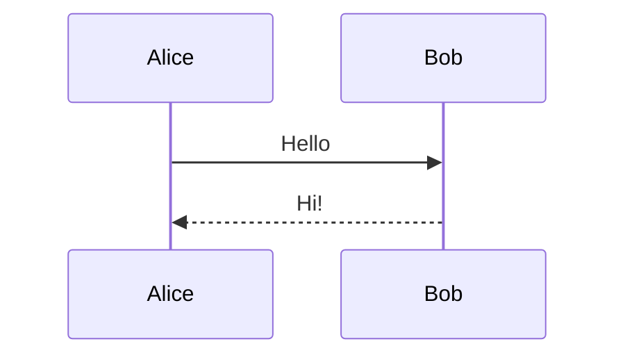
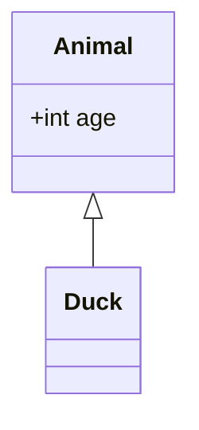

# Mermaid Diagram Support for PDF Conversion

This guide explains how to set up Mermaid diagram rendering for the `md_to_pdf.py` script.

## Overview

The `md_to_pdf.py` script can automatically convert Mermaid diagrams embedded in Markdown files to images before generating PDFs. This ensures diagrams are properly rendered in the final PDF output.

## Prerequisites

- **Pandoc**: Document converter (required for all PDF generation)
- **XeLaTeX**: LaTeX engine for PDF output
- **Node.js**: JavaScript runtime (required for mermaid-cli)
- **mermaid-cli**: Command-line tool for converting Mermaid diagrams

## Installation

### 1. Install Pandoc

```bash
# macOS
brew install pandoc

# Linux (Ubuntu/Debian)
sudo apt-get install pandoc

# Verify installation
pandoc --version
```

### 2. Install XeLaTeX

```bash
# macOS (using BasicTeX - minimal installation)
brew install --cask basictex

# Or full MacTeX
brew install --cask mactex

# Linux (Ubuntu/Debian)
sudo apt-get install texlive-xetex

# Verify installation
xelatex --version
```

### 3. Install Node.js (if not already installed)

```bash
# macOS
brew install node

# Linux (using nvm - recommended)
curl -o- https://raw.githubusercontent.com/nvm-sh/nvm/v0.39.0/install.sh | bash
nvm install node

# Verify installation
node --version
npm --version
```

### 4. Install mermaid-cli

```bash
# Install globally (recommended)
npm install -g @mermaid-js/mermaid-cli

# Verify installation
mmdc --version
```

**Note**: Global npm packages are installed to:
- macOS with Homebrew: `/opt/homebrew/lib/node_modules/`
- Linux: `/usr/lib/node_modules/` or `~/.npm-global/`

### 5. (Optional) Install pypandoc

For better error handling in Python:

```bash
pip install pypandoc
```

## Usage

### Basic Usage

```bash
# Convert markdown to PDF (Mermaid diagrams are auto-detected)
python scripts/md_to_pdf.py docs/example.md

# Specify output path
python scripts/md_to_pdf.py docs/example.md -o output/example.pdf
```

### Options

| Option | Description |
|--------|-------------|
| `-o, --output` | Output file path |
| `--latex-only` | Generate LaTeX only, no PDF |
| `--no-mermaid` | Skip Mermaid preprocessing |
| `--title` | Document title |
| `--author` | Document author |
| `--debug` | Print debug output on failures |

### Examples

```bash
# Convert with custom title
python scripts/md_to_pdf.py docs/tutorial.md --title "My Tutorial"

# Skip Mermaid preprocessing
python scripts/md_to_pdf.py docs/simple.md --no-mermaid

# Debug Mermaid conversion issues
python scripts/md_to_pdf.py docs/diagrams.md --debug
```

## How It Works

1. **Detection**: Script scans for ` ```mermaid ` code blocks
2. **Conversion**: Each Mermaid block is converted to PNG using `mmdc`
3. **Replacement**: Code blocks are replaced with image references
4. **PDF Generation**: Pandoc converts the preprocessed markdown to PDF

### Generated Files

After conversion, you'll find:

```
docs/
├── example.md              # Original markdown
├── pdf/
│   ├── example.pdf         # Generated PDF
│   └── mermaid_images/     # Generated diagram images
│       ├── mermaid_1_abc123.png
│       └── mermaid_2_def456.png
```

## Mermaid Diagram Syntax

The script supports all standard Mermaid diagram types:

### Flowchart

````markdown

````

### Sequence Diagram

````markdown

````

### Class Diagram

````markdown

````

### State Diagram

````markdown

````

## Troubleshooting

### "mermaid-cli not found"

```bash
# Check if mmdc is in PATH
which mmdc

# If not found, reinstall
npm install -g @mermaid-js/mermaid-cli

# Or check npm global bin directory
npm bin -g
```

### "Diagrams render but text is missing"

This happens with SVG output. The script uses PNG format to ensure text renders correctly in PDFs.

### "Images are too large in PDF"

The script uses a scale factor of 2 for quality. You can modify the `-s` parameter in `md_to_pdf.py` if needed.

### "Conversion times out"

Complex diagrams may take longer. The default timeout is 60 seconds per diagram.

### "puppeteer/chromium errors"

mermaid-cli uses Puppeteer (headless Chrome) for rendering:

```bash
# macOS: Install Chromium
brew install chromium

# Linux: Install dependencies
sudo apt-get install chromium-browser
```

## Batch Conversion

To convert multiple files:

```bash
# Convert all markdown files in a directory
for f in docs/causal_inference/*.md; do
  name=$(basename "$f" .md)
  python scripts/md_to_pdf.py "$f" -o "docs/causal_inference/pdf/${name}.pdf"
done
```

## Version Information

Tested with:
- Pandoc 3.x
- mermaid-cli 11.x
- Node.js 18+
- XeLaTeX (TeX Live 2024+)

